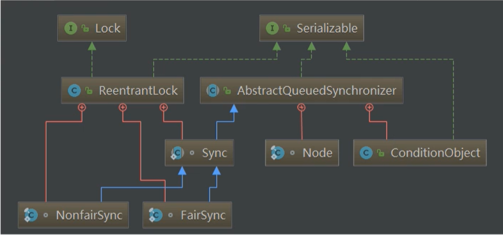
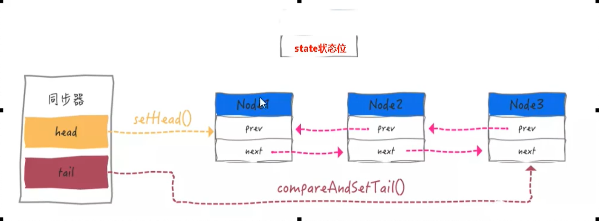

# AbstractQueuedSynchronizer(AQS)

## AQS是什么？

> 字面意思：抽象的队列同步器
>
> 技术解释：是用来构建锁或者其他同步器组件的重量级基础框架及整个JUC体系的基石，通过内置		的FIFO队列来完成资源获取线程的排队工作，并通过一个int类型变量表示持有锁的状态

CLH队列：是一个单向链表，AQS中的队列是CLH变体的虚拟双向队列FIFO

## AQS为什么是JUC内容中最重要的基石

 锁：面向锁的使用者     定义了程序员和锁交互的使用层API 隐藏了实现细节 你调用即可

 同步器：面向锁的实现着    比如java并发大神DougLee，提出统一规范并简化了锁的实现，屏蔽了同    步状态管理、阻塞线程排队和通知、唤醒机制等 

## AQS能干什么

加锁会导致阻塞：有阻塞就需要排队，实现排队必然需要有某种形式的队列进行管理

解释说明：抢到资源的线程直接使用处理业务逻辑，抢不到资源的必然涉及一种排队等候机制。抢占资源失败的线程继续去等待（类似银行业务办理窗口都满了，暂时没有受理窗口的顾客只能去候客区排队等候），但等候线程仍然保留获取锁的可能且获取锁流程仍在继续（候客区的顾客也在等着叫号，轮到了再去受理窗口办理业务）。

既然说到了排队等候机制，那么就一定会有某种队列形成，这样的队列是什么数据结构呢？

如果共享资源被占用，就需要一定的阻塞等待唤醒机制来保证锁的分配，这个机制主要用的是CLH队列的变体实现，将暂时获取不到锁的线程加入到队列中，这个队列就是AQS的抽象表现，他将请求共享资源的线程封装成队列的节点（Node），通过CAS、自旋以及LockSupport.park()的方式，维护state变量的状态，使并发达到同步的效果。 

## AQS初步

有阻塞就需排队，实现队列必然需要队列

> AQS使用一个volatile的int类型的成员变量来表示同步状态，通过内置的FIFO队列来完成资源获取的排队工作将每条要去抢占资源的线程封装成一个 Node节点来实现锁的分配，通过CAS完成对State值得修改

AQS的内部架构

AQS的int变量：

​	AQS的同步状态State成员变量 private volatile int state

​	银行办理业务的受理窗口状态  0就是没人，自由状态可以办理 大于等于1，有人占用窗口等着

AQS的CLH队列

​	CLH队列（三个大牛的名字组成），为一个双向队列

​	银行候客区的等待顾客

总结：

​	有阻塞就需要排队，实现队列必然需要队列

​	state变量+CLH变种的双端队列

```JAVA
static final class Node {
        /** Marker to indicate a node is waiting in shared mode */
    	//共享
        static final Node SHARED = new Node();
        /** Marker to indicate a node is waiting in exclusive mode */
    	//独占
        static final Node EXCLUSIVE = null;

        /** waitStatus value to indicate thread has cancelled */
    	//线程被取消了
        static final int CANCELLED =  1;
        /** waitStatus value to indicate successor's thread needs unparking */
    	//后继线程需要唤醒
        static final int SIGNAL    = -1;
        /** waitStatus value to indicate thread is waiting on condition */
        //等待condition唤醒
   		 static final int CONDITION = -2;
        /**
         * waitStatus value to indicate the next acquireShared should
         * unconditionally propagate
         */
        // 共享式同步状态获取将会无条件地传播下去
        static final int PROPAGATE = -3;

        /**
         * Status field, taking on only the values:
         *   SIGNAL:     The successor of this node is (or will soon be)
         *               blocked (via park), so the current node must
         *               unpark its successor when it releases or
         *               cancels. To avoid races, acquire methods must
         *               first indicate they need a signal,
         *               then retry the atomic acquire, and then,
         *               on failure, block.
         *   CANCELLED:  This node is cancelled due to timeout or interrupt.
         *               Nodes never leave this state. In particular,
         *               a thread with cancelled node never again blocks.
         *   CONDITION:  This node is currently on a condition queue.
         *               It will not be used as a sync queue node
         *               until transferred, at which time the status
         *               will be set to 0. (Use of this value here has
         *               nothing to do with the other uses of the
         *               field, but simplifies mechanics.)
         *   PROPAGATE:  A releaseShared should be propagated to other
         *               nodes. This is set (for head node only) in
         *               doReleaseShared to ensure propagation
         *               continues, even if other operations have
         *               since intervened.
         *   0:          None of the above
         *
         * The values are arranged numerically to simplify use.
         * Non-negative values mean that a node doesn't need to
         * signal. So, most code doesn't need to check for particular
         * values, just for sign.
         *
         * The field is initialized to 0 for normal sync nodes, and
         * CONDITION for condition nodes.  It is modified using CAS
         * (or when possible, unconditional volatile writes).
         */
    	//初始为0状态是上面的几种 
    	//0 当一个Node被初始化的时候的默认值 
        //CANCELLED 为1 表示线程获取锁的请求已经取消了
        //condition 为-2 表示节点在等待队列中 节点线程等待唤醒
        //PROPAGATE 为-3 当前线程处在SHARED情况下 该字段才会使用
        volatile int waitStatus;

        /**
         * Link to predecessor node that current node/thread relies on
         * for checking waitStatus. Assigned during enqueuing, and nulled
         * out (for sake of GC) only upon dequeuing.  Also, upon
         * cancellation of a predecessor, we short-circuit while
         * finding a non-cancelled one, which will always exist
         * because the head node is never cancelled: A node becomes
         * head only as a result of successful acquire. A
         * cancelled thread never succeeds in acquiring, and a thread only
         * cancels itself, not any other node.
         */
    	//前置节点
        volatile Node prev;

        /**
         * Link to the successor node that the current node/thread
         * unparks upon release. Assigned during enqueuing, adjusted
         * when bypassing cancelled predecessors, and nulled out (for
         * sake of GC) when dequeued.  The enq operation does not
         * assign next field of a predecessor until after attachment,
         * so seeing a null next field does not necessarily mean that
         * node is at end of queue. However, if a next field appears
         * to be null, we can scan prev's from the tail to
         * double-check.  The next field of cancelled nodes is set to
         * point to the node itself instead of null, to make life
         * easier for isOnSyncQueue.
         */
    	//后继节点
        volatile Node next;

        /**
         * The thread that enqueued this node.  Initialized on
         * construction and nulled out after use.
         */
    	//包装的线程
        volatile Thread thread;

        /**
         * Link to next node waiting on condition, or the special
         * value SHARED.  Because condition queues are accessed only
         * when holding in exclusive mode, we just need a simple
         * linked queue to hold nodes while they are waiting on
         * conditions. They are then transferred to the queue to
         * re-acquire. And because conditions can only be exclusive,
         * we save a field by using special value to indicate shared
         * mode.
         */
    	// 下一个等待的节点
        Node nextWaiter;

        /**
         * Returns true if node is waiting in shared mode.
         */
        //如果节点在共享模式下等待，则返回true
        final boolean isShared() {
            return nextWaiter == SHARED;
        }

        /**
         * Returns previous node, or throws NullPointerException if null.
         * Use when predecessor cannot be null.  The null check could
         * be elided, but is present to help the VM.
         *
         * @return the predecessor of this node
         */
    	//返回上一个节点，如果为null，则抛出NullPointerException 空检查
        final Node predecessor() throws NullPointerException {
            Node p = prev;
            if (p == null)
                throw new NullPointerException();
            else
                return p;
        }
		// 空构造
        Node() {    // Used to establish initial head or SHARED marker
        }
		// 构造方法 thread线程 mode
        Node(Thread thread, Node mode) {     // Used by addWaiter
            this.nextWaiter = mode;
            this.thread = thread;
        }
		// 构造方法 thread线程 waitStatus 线程等待状态
        Node(Thread thread, int waitStatus) { // Used by Condition
            this.waitStatus = waitStatus;
            this.thread = thread;
        }
    }
```

AQS同步队列的基本结构


## 从我们的ReentrantLock开始解读AQS

